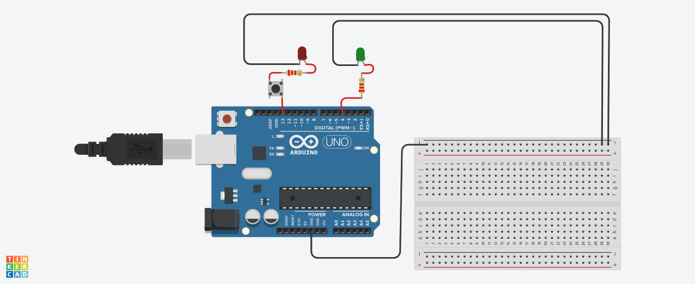

# Curso-Extens-o-Iot-iniciantes
Curso de extenção IoT na prática para iniciantes

1)Primeito projeto em arduino para iniciantes

<a href="piscapisca.ino">Clique aqui para visualizar o código do projeto</a>
