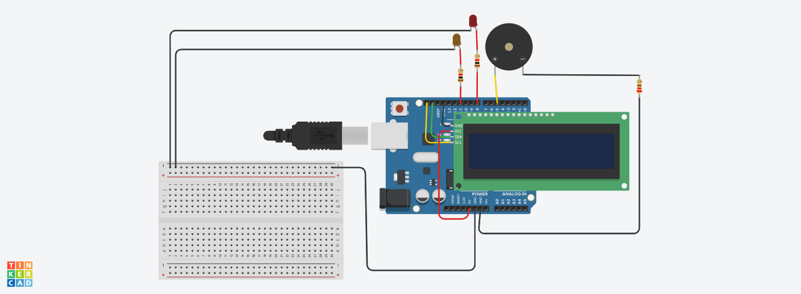
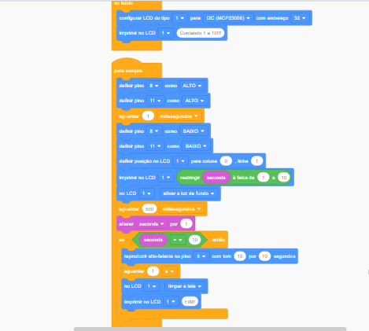

# Curso-Extens-o-Iot-iniciantes
Curso de extenção IoT na prática para iniciantes

projeto autoral feito no simulador do tinkcard para o projeto final do curso de extensão de IoT para iniciantes.
Desenvolvi no Tink card usando uma placa de Arduino Uno.

*Placa LCD usada para mostrar a contagem de 1 até 10.
* Enquando e após ser feita a contagem os dois LEDs ficam piscando.
* quando chega no 10 aciona o IF(se) que liga o piezo por 5 segundos e encerra o som.

-OBS:Antes de chegar ao 10 diminua o volume de seu dispositivo.

Código em blocos:

<a href="contador_alerta1.ino">Clique aqui para visualizar o código do projeto</a>
